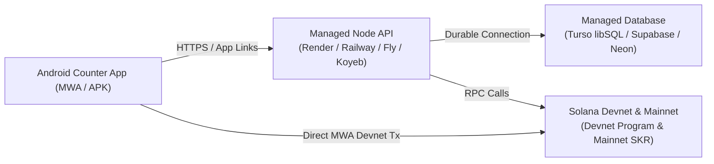

# COUNTER — DIRECTOR STATE & IMPLEMENTATION LEDGER

**Project:** Counter (Mobile Social Network for 1v1 Duels, Backer Pools, Authoritative Settlement, and Permanent Receipts on Solana Mobile)  
**Location:** `C:\Users\HomePC\Desktop\Counter`  
**Role:** BUILDER  
**Current Authoritative Status:** `BUILDING — REMOTE BACKEND HOSTING REPLACEMENT REQUIRED`  
**Repository State:** On branch `master`  
**Last Updated:** 2026-09-29T07:10:00+01:00  

---

## 1. Executive Summary & Authoritative Status Transition

Per Director Directive (2026-09-29), the user's VPS (`103.195.188.198`) is **strictly decommissioned and de-authorized for Counter** to prevent any interference with other user workloads. 

- **VPS Access:** Completely halted. No SSH connections, deployments, service restarts, package installs, or configuration modifications will be executed on the VPS.
- **Economic & On-Chain State:** All on-chain Solana Devnet program escrows, PDA controls, parimutuel math, authorized resolution, receipts, SKR mainnet stake derivations, and SIWS cryptography remain **100% PRESERVED and ACCEPTED**.
- **Current Objective:** Migrate Counter's remote social backend, faucet authority, and persistence to a managed hosting architecture (e.g. Render / Railway / Fly / Vercel + Turso/Supabase/Neon) with a stable public HTTPS URL and durable database.

---

## 2. VPS Change Audit Inventory (Historical Record)

Prior to the de-authorization directive, the following actions and files were introduced on the VPS (`103.195.188.198`). **No automatic rollback or deletion will be performed without explicit Director/User authorization.**

| Category | Item / Path | Classification | Details |
|---|---|---|---|
| **Directories Created** | `/opt/counter`, `/opt/counter/server/config` | `COUNTER SPECIFIC` | Cloned Counter repo and npm dependencies |
| **Files Created** | `/opt/counter/server/config/authority-keypair.json` | `COUNTER SPECIFIC` | Devnet test faucet keypair (public test funds only) |
| **Database File** | `/opt/counter/server/data/counter.sqlite` | `COUNTER SPECIFIC` | Dedicated Counter SQLite database file |
| **Systemd Service** | `/etc/systemd/system/counter-backend.service` | `COUNTER SPECIFIC` | Systemd unit file running `node index.js` on port `8795` |
| **Caddy Config** | `/etc/caddy/Caddyfile` (appended block) | `SHARED / DO NOT TOUCH` | Added virtual host block `counter.103-195-188-198.sslip.io` proxying to `127.0.0.1:8795` |
| **Services Restarted** | `caddy.service` (reloaded), `counter-backend.service` | `SHARED / DO NOT TOUCH` | Reloaded Caddy to read virtual host; enabled/started counter-backend |
| **Ports Bound** | `127.0.0.1:8795` | `COUNTER SPECIFIC` | Internal loopback bind only (no firewall changes) |
| **Packages Installed** | Node modules inside `/opt/counter/server/node_modules` | `COUNTER SPECIFIC` | Local npm install inside isolated folder |
| **TLS Certs** | Auto-managed Caddy ACME cert for `counter.103-195-188-198.sslip.io` | `SHARED / DO NOT TOUCH` | Managed by Caddy's internal ACME storage |

---

## 3. Managed Hosting Replacement Architecture Plan

To fulfill the requirement of **remote backend + durable persistence independent of the local dev machine**, the proposed managed architecture:

### Managed Hosting Components:
1. **API Tier:** Managed Node.js / Express web service on Render, Railway, Fly.io, or Koyeb connected to `https://github.com/Techkeyy/counter`.
2. **Durable Database Tier:** 
   - Managed serverless SQLite (Turso / libSQL) or Postgres (Supabase / Neon), eliminating local disk filesystem dependence and providing global durability across service restarts.
3. **Automated HTTPS & App Links:**
   - Platform-assigned stable HTTPS domain (e.g., `https://counter-api.onrender.com` or custom domain) with automatic zero-config TLS.
   - Hosted `/.well-known/assetlinks.json` matching the Android debug APK signing fingerprint (`3A:7E:F2:26:5B:5E:6E:88:F3:6D:44:49:89:4C:4E:C8:68:95:C1:CC:88:53:0F:19:51:4E:E4:F7:16:A1:5A:99`).
4. **Environment Configuration:**
   - Secrets managed via platform environment variables (`PORT`, `NODE_ENV`, `PROGRAM_ID`, `DEVNET_CUSD_MINT`, `DEVNET_RPC`, `FAUCET_AUTHORITY_KEYPAIR_BASE64`).

---

## 4. Preserved On-Chain Economic & Financial Foundation (Accepted Devnet Level 4)

All financial and on-chain escrow components remain intact and fully proven:

- **Program ID:** `52QgqEmxZzh2EH1gAwheMmp2ZXd9eT3WuXefSLYu6NmT`
- **Duel PDA:** `BmbhSEGAPfuZASzjx2Xibp4AWM2z7gsZtkTrq3Z7tNWz`
- **Vault PDA:** `8vbAvwYc7PjQHjC5PTqG6MQ7fkXLBPWa4b6NHxBgYdnq`
- **Vault Token ATA:** `2Xpm9gdyzZSqFBCEcCuUuXknjdxE9ceWRMoTs3SY8pU1`
- **Wager Asset:** Devnet cUSD (`AXMB7tf5yHqPuFRTzaMgNSGPZ8iKJtFkeYdpeN7jcHWC`)
- **Accepted On-Chain Transactions:**
  - Init: `2wEPDVpPQ9YdfSKEqh6h4N45UHnJDFRTREQAxRppWdnQr5gjxNBkJZxvrGqEjCWBMhxEQKvsscHjeN86i2MkVfZW`
  - Stake A ($50): `42UU2V6mTySEsXd2dSRTk43zkiVksANDWh4aSFhkqQwUzvhiuMoN6rjoRHbkwncVsVikxc7PeYP5iHJmzCsVxNYv`
  - Stake B ($50): `3CCE1v9eeapwbGjaNCRoBAkpaigwiqaHFW1rWBSD7inF93eVDLpZoZVmwJYfGfyV4ddtTG7Cfv1Dianfc8E5o7Zb`
  - Stake C ($25): `TSSbgu9gwTtdCMx4Vn15QRYCQMonJ4hypdLTZvfRvBuqjV7yAXdH57VoANPyuBK44KZE1BB6f4waV9YsAUKATjq`
  - Resolution: `8Yjzcm66aQ22MRB1Mk1uyykcweKqEbNhkbkbRN8F1ReE4gFaWZF9sz1v7chMLMMgQSStbXr7cwMZgsUzUCuNPnN`
  - Claim A: `4d1qrAj44ATDDM5AwtxQB5aC39v1sic1mxmqzPY6GfjBDi3PwWADuPPdeTph4xReJeLofhXdqziAYzswJjdrHX8j`
  - Claim C: `4wJPZ6pYqyKBsfcg3gjqJ8QPZHwc4NanHThZrTwkjZRCaifG5wiJJqVZUK8vicx14zpWWb3hbbB9bmMMqtpzW2td`
  - Faucet Mint Tx: `Q1RnAJM5SbLYess5viZCUyTwFVziPs6kR2UcjznfcRorqrik9Szop4Lu49s6GSnZs8pLfNafqJDecgdq4uqwPFQ`
- **16-Invariant Compliance:** All 16 audit invariants verified.

---

## 5. Truthful Hardware / UAT Classification Table

| Subsystem | Verified Level | Status | Notes |
|---|---|---|---|
| **SIWS Server Verification** | Cryptographic Ed25519 nacl detached signature validation with replay-protected random nonces | **PROVEN** | 100% Pass across automated suites and bridge harness |
| **Android MWA / SIWS Roundtrip** | Native MWA 2.0 protocol client bundled in APK, connecting to Solana Mobile wallet | **PENDING OWNER UAT** | Requires physical Saga/Seeker or Android device with Seed Vault |
| **App Link Configuration** | Hosted `/.well-known/assetlinks.json` returning 200 OK with correct fingerprints | **PENDING MANAGED DEPLOYMENT** | Will be deployed to managed host |
| **Deep Link App Launch** | Intent filters configured in AndroidManifest for `counter://` and `https://` schemes | **PENDING DEVICE UAT** | Requires physical Android device or external browser redirect |
| **Remote Backend Hosting** | Managed API & Database | **REPLACEMENT REQUIRED** | VPS decommissioned; transitioning to managed platform |
